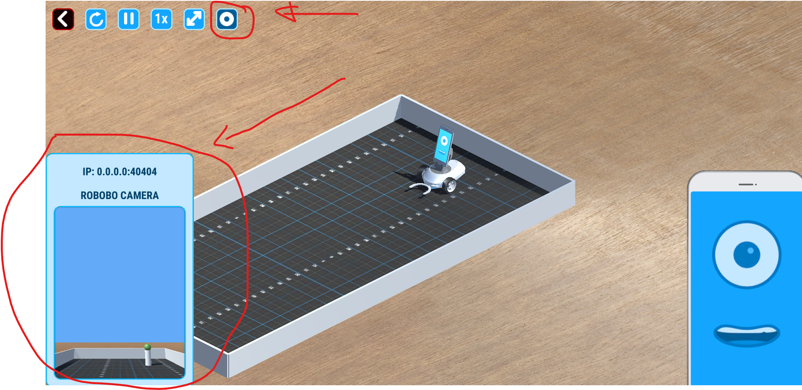

# Automated Robobo with LLM (GPT-4 )

This project is part of a Master's thesis at the Universidade da Coruña. It aims to automate the Robobo robot using the Language Model LLM (GPT-4) to perform various tasks.

## Description

This project is part of a Master's thesis at the Universidade da Coruña. It aims to automate the Robobo robot using the Language Model LLM (GPT-4) to perform various tasks. The project captures screenshots and sensors data from a Robobo robot and saves them in a specified directory, supporting both real and simulation modes. It includes functionalities to take screenshots, delete images, and encode images in base64 format. Additionally, it integrates with OpenAI's GPT-4 to generate responses based on user prompts, enabling the robot to perform actions such as moving, turning, and speaking based on the generated responses.
## Installation

1. Clone the repository:
    ```sh
    git clone https://github.com/fhvaldes31/Automed-Robobo-with-LLM.git
    ```
2. Navigate to the project directory:
    ```sh
    cd yourproject
    ```
3. Install the required dependencies:
    ```sh
    pip install -r requirements.txt
    ```
4. For the real mode, you need to check the following repository and follow the instructions to install the Robobo VideoStream library:
    ```https://github.com/mintforpeople/robobo-python-video-stream```

4.1 For the simulation mode, you need to check the robobo camera is open like the following image:
    

5. You need to create a .env file in the root directory of the project and add the following variables:
    
   ```# .env
   OPENAI_API_KEY="your-openai-api-key"
   ROBOT_IP="192.168.1.135"  # Replace with the actual IP address```


## Usage

1. Configure the mode in `config.py`:
    ```python
    config = Config(mode='real')  # or 'simulation'
    ```
2. Run the main script, you need to have a world in the Robobo Simulator open or the real Robobo working ready for connection:
    ```sh
    python main.py
    ```

